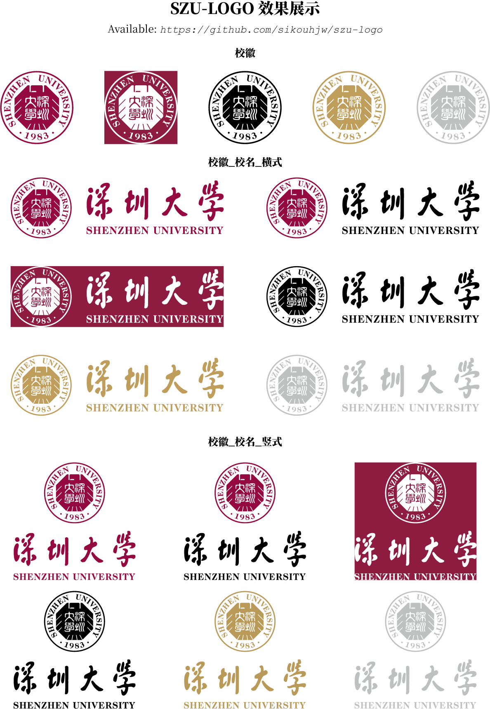

# szu-logo
深圳大学校徽矢量图

## 版权声明
- **校徽版权归[深圳大学](https://www.szu.edu.cn/)所有，本仓库仅用于教育与学习目的。**
- 官方源文件（`.ai` 文件）下载：[深大标识](https://www.szu.edu.cn/xxgk/sdbs.htm)。

## 使用说明
- 矢量图说明：矢量图是由数学公式描述的图像，放大或缩小时不会失真。
- 本仓库主要提供校徽的矢量格式文件，便于在不同场景中使用：
  - `.svg` 文件：适用于 Word、PPT 等办公软件；
  - `.pdf` 文件：适用于 LaTeX 等排版软件；
  - `.png` 文件（非矢量格式；150 dpi）：属于位图格式，存在缩放失真问题，建议优先使用矢量文件。
- 提供多种配色版本：
  - 紫色
    - `[C,M,Y,K]=[10,97,37,43]`
  - 反白（适用于深色背景）
    - `[C,M,Y,K]=[00,00,00,00]`
  - 黑色
    - `[C,M,Y,K]=[00,00,00,100]`
  - 金色
    - `[C,M,Y,K]=[30,40,70,00]`
  - 灰色
    - `[C,M,Y,K]=[00,00,00,35]`

## 效果展示
